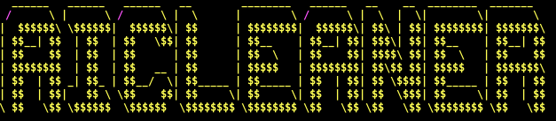

# AiCleaner

 

  
  <h3 align="center">AiCleaner 
  Audio denoising real-time powered by artificial intelligence (Uncomplete)</h3>

>Name of the project may change on future.

<!-- TABLE OF CONTENTS -->
## Table of Contents

- [AiCleaner](#aicleaner)
  - [Table of Contents](#table-of-contents)
  - [About The Project](#about-the-project)
    - [AI Models implemented](#ai-models-implemented)
    - [Roadmap](#roadmap)
    - [License](#license)

<!-- ABOUT THE PROJECT -->
## About The Project

This is an open-source project that wants to process audio input with denoising techniques, python-friendly and in real-time. Due restrictions may be on-premise or with payment to process on the cloud if necessary. Check the [ROADMAP](ROADMAP.md).

### AI Models implemented

AIModels supported by any ai-library on python (keras, tensorflow, pytorch, caffe). Create an issue if you want to add your model and we're going to adapt it.

Table 1. Models already implemented

| ✔️/x | Type    | Model name         | Repository                                                                                                 | Demo                                              | License |
| --- | ------- | ------------------ | ---------------------------------------------------------------------------------------------------------- | ------------------------------------------------- | ------- |
| ✔️   | U-Net   | Speech-Enhancement | [Original](https://github.com/vbelz/Speech-enhancement) [Adapted](https://github.com/DZDL/audio-denoising) | [Heroku](https://github.com/DZDL/audio-denoising) | MIT     |
| x   | Unknown | DNP                | [Original](https://github.com/mosheman5/DNP) [Adapted](https://github.com/DZDL/audio-denoiser)             | Broken                                            | Unfound |

### Roadmap

Check the [ROADMAP](ROADMAP.md).

### License

This repository is under MIT license, check full [here](LICENSE.md).
