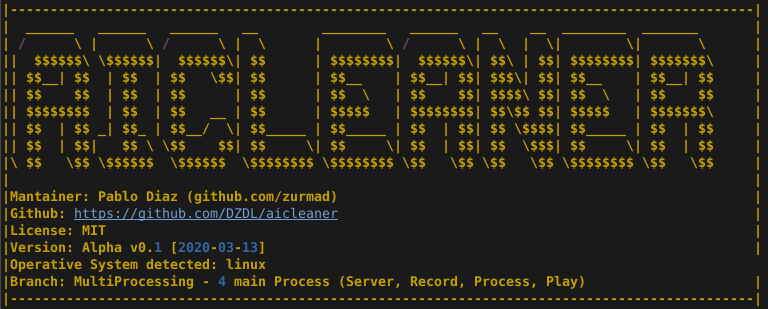

# AiCleaner

<br />
<p align="center">
  <a href="#">
    
  </a>
  <h3 align="center">AiCleaner<br>
  Audio denoising real-time powered by artificial intelligence (Alpha)</h3>
</p>

>Name of the project may change on future.
<hr style="height:2px;border-width:0;color:gray;background-color:gray">

<!-- TABLE OF CONTENTS -->
## Table of Contents

- [AiCleaner](#aicleaner)
  - [Table of Contents](#table-of-contents)
  - [About The Project](#about-the-project)
    - [How to run](#how-to-run)
      - [On-premise Linux](#on-premise-linux)
      - [Cloud hosted](#cloud-hosted)
      - [Docker version](#docker-version)
    - [AI Models implemented](#ai-models-implemented)
    - [Roadmap](#roadmap)
    - [License](#license)


<!-- ABOUT THE PROJECT -->
## About The Project

This is an open-source project that wants to process audio input with denoising techniques, python-friendly and in real-time. All processing on-premise but can be handled by a server. Check the [ROADMAP](ROADMAP.md).

### How to run

There are multiple ways to run: on-premise version (as personal user), on-cloud version (as enterprise digestor system) and docker version (as personal user in uncommon SO.). (suggest new one).

#### On-premise Linux

Apt
```
sudo apt-get update
sudo apt-get install tensorflow-model-server
# More info https://www.tensorflow.org/tfx/serving/setup
```

Pip
```
git clone https://github.com/DZDL/aicleaner
cd aicleaner
pip3 install -r requirements.txt
python3 main.py
```

#### Cloud hosted

Not yet implemented.

#### Docker version

Not yet implemented.

### AI Models implemented

AIModels supported by any ai-library on python (keras, tensorflow, pytorch, caffe). Create an issue if you want to add your model and we're going to adapt it.

Table 1. Models already implemented

| ✔️/x | Type    | Model name         | Repository                                                                                                 | Demo                                              | License |
| --- | ------- | ------------------ | ---------------------------------------------------------------------------------------------------------- | ------------------------------------------------- | ------- |
| ✔️   | U-Net   | Speech-Enhancement | [Original](https://github.com/vbelz/Speech-enhancement) [Adapted](https://github.com/DZDL/audio-denoising) | [Heroku](https://github.com/DZDL/audio-denoising) | MIT     |
| x   | Unknown | DNP                | [Original](https://github.com/mosheman5/DNP) [Adapted](https://github.com/DZDL/audio-denoiser)             | Broken                                            | Unfound |


### Roadmap

Check the [ROADMAP](ROADMAP.md).

### License

This open-source repository is under MIT license, check full [here](LICENSE.md).
